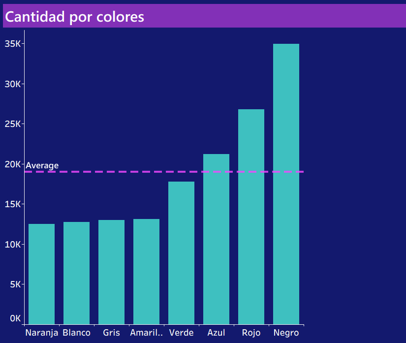
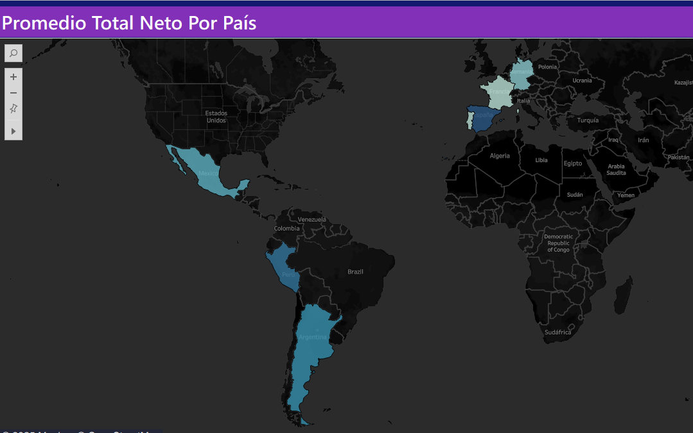
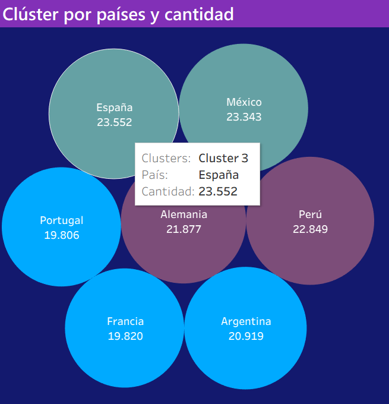
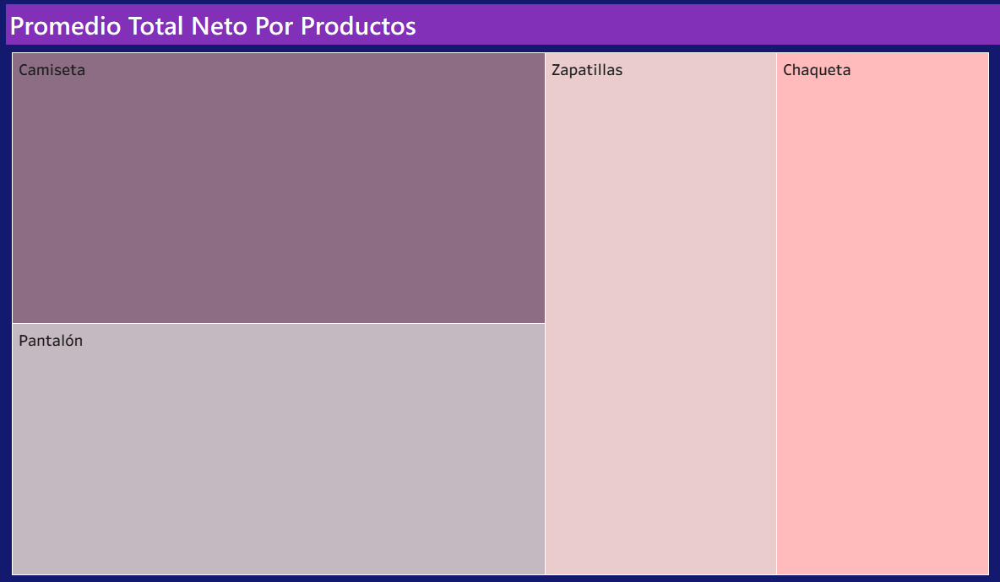
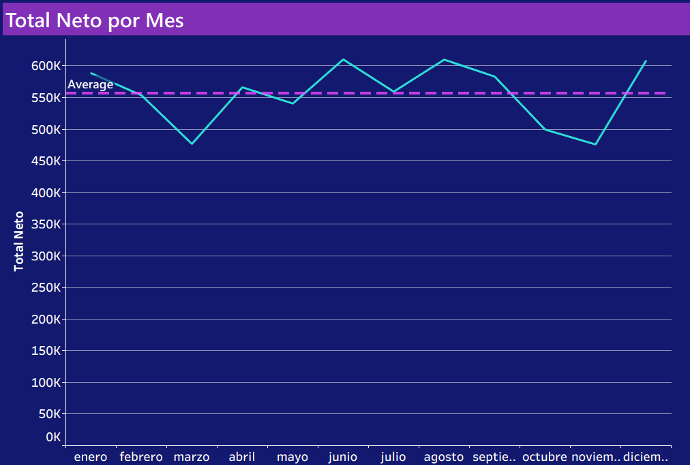
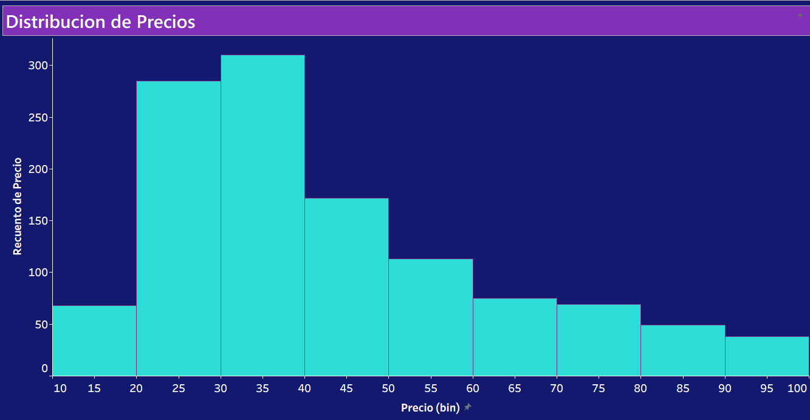

# 📊 Análisis de Ventas Netas por Producto, Color y País — Dashboard en Tableau

Este proyecto presenta un dashboard interactivo realizado en Tableau, diseñado para analizar las ventas netas entre los años 2019 y 2021. El análisis incluye métricas como cantidad de productos vendidos, precios, colores preferidos, comportamiento por país y evolución temporal, con el objetivo de descubrir patrones de consumo y oportunidades de negocio.

  

---

## 📁 Descripción del dataset

- **Archivos utilizados**:  
  - `Datos de facturación.xlsx`  
  - `Fechas.xlsx`  
  - `Países.xlsx`

- **Período analizado**:  
  Desde **2019 hasta 2021**

- **Métricas clave**:  
  - Total neto de ventas  
  - Cantidad de artículos vendidos  
  - Tipos de producto  
  - Preferencias por color  
  - Rango de precios  
  - Segmentación por país y por mes

---

## 🛠️ Herramientas utilizadas

- **Tableau Desktop**  
- **Microsoft Excel** (limpieza de datos)  
- **Mapbox** (visualización geográfica)
- 

---

## 📊 Visualizaciones principales

### 🎨 Cantidad por color

Permite identificar los colores más vendidos. Se destacan el negro, rojo y azul.

---

### 🌍 Promedio total neto por país (mapa)

Muestra los países con mayor volumen de ventas netas. España, Perú y Argentina son los líderes.

---

### 🔻 Clúster por país y cantidad

Agrupación de países según el volumen de compras para identificar patrones de comportamiento por región.

---

### 📦 Promedio total neto por producto

Treemap que compara el rendimiento de cada tipo de producto. Las camisetas y los pantalones tienen mayor volumen de venta.

---

### 📈 Total neto por mes

Gráfico de líneas que muestra la evolución mensual de ventas. Se observan picos en julio y noviembre.

---

### 💰 Distribución de precios

Histograma con los precios de venta. La mayoría de los productos se ubican entre los 25 y 50 unidades monetarias.

---

## 💡 Principales insights

- **España** lidera en ventas netas, seguida por **Perú** y **Argentina**.
- Los productos de color **negro** y **rojo** son los más vendidos.
- Los meses con mayor volumen de ventas son **julio** y **noviembre**.
- Los precios más frecuentes están entre **25 y 50 unidades monetarias**.
- La segmentación por país y producto permite identificar oportunidades de marketing y optimización de stock.

---

## 👨‍💻 Autor

**Octavio Alvarez**  
Analista de Datos — Tableau Developer  
[LinkedIn](https://www.linkedin.com/in/octavio-alvarez-6a229b223/)

